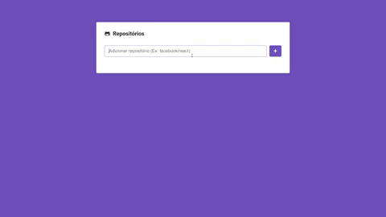

<h1 align="center">
  
  React Github Overview 
  
</h1>

<h4 align="center">
  A webapp developed with ReactJS to search for repositories and take a look at its data
</h4>

<p align="center">
  
  
</p>

<p align="center">
  <a href="#technologies">Used Technologies</a>&nbsp;&nbsp;&nbsp;|&nbsp;&nbsp;&nbsp;
  <a href="#objective">Project's goal</a>&nbsp;&nbsp;&nbsp;|&nbsp;&nbsp;&nbsp;
  <a href="#final-result">Final Result</a>&nbsp;&nbsp;&nbsp;|&nbsp;&nbsp;&nbsp;
  <a href="#how-to-use">How to Run</a>
</p>

&nbsp;&nbsp;&nbsp;&nbsp;&nbsp;&nbsp;&nbsp;&nbsp;&nbsp;
&nbsp;&nbsp;&nbsp;&nbsp;&nbsp;&nbsp;&nbsp;&nbsp;&nbsp;
&nbsp;&nbsp;&nbsp;&nbsp;&nbsp;&nbsp;&nbsp;&nbsp;&nbsp;
&nbsp;&nbsp;&nbsp;&nbsp;&nbsp;&nbsp;&nbsp;&nbsp;&nbsp;
&nbsp;&nbsp;&nbsp;&nbsp;

<h2 id="techonologies" name="technologies">
  :rocket: Used Technologies
</h2>

- [ReactJS](https://pt-br.reactjs.org/) to build the app in general
- [Styled Components](https://styled-components.com/) to style the app
- [React Router](https://reactrouter.com/) to make multiple routes
- [Sweet Alert](https://sweetalert.js.org/) to make some toast messages
- Github API to get all the data that we need

<h2 id="objective" name="objective">
  :dart: Project's goal
</h2>

The aim of this project was practicing React, a great tech that I've started learning recently, with this app, I could practice some concepts that I've learned at first with Vue.js, these concepts are things like props, conditional rendering, components managment in React, styling with styled components, I enjoyed it really much and I'll keep learning React for sure, I really liked it!

<h2 id="final-result" name="final-result">
  :clipboard: Resultado final
</h2>

### [You can check the final result clicking here](https://react-github-viewer.netlify.app/)

<h2 id="how-to-use" name="how-to-use">
  :information_source: How to Run
</h2>

Follow the steps below to run the project in your machine, before it all, you need to have the Git, Node.js and Yarn installed on your computer, then follow the steps below:

```bash
# Clone the repo
$ git clone https://github.com/TiagoDiass/react-github-viewer.git

# Enter in the directory
$ cd react-github-viewer

# Install the dependencies
$ yarn

# Start the app
$ yarn start
```

After following these steps, your terminal will show you what port is the app running on(it's usually the 3000), so you'll just need to open your browser
and open `localhost:3000`. To stop the app just go back to the terminal and press <kbd>CTRL</kbd>+<kbd>C</kbd>.

---

Hope you enjoyed this project :smiley:<br>
:wave: [Get in touch!](https://www.linkedin.com/in/tiagodiass)

### Author: Tiago Dias


